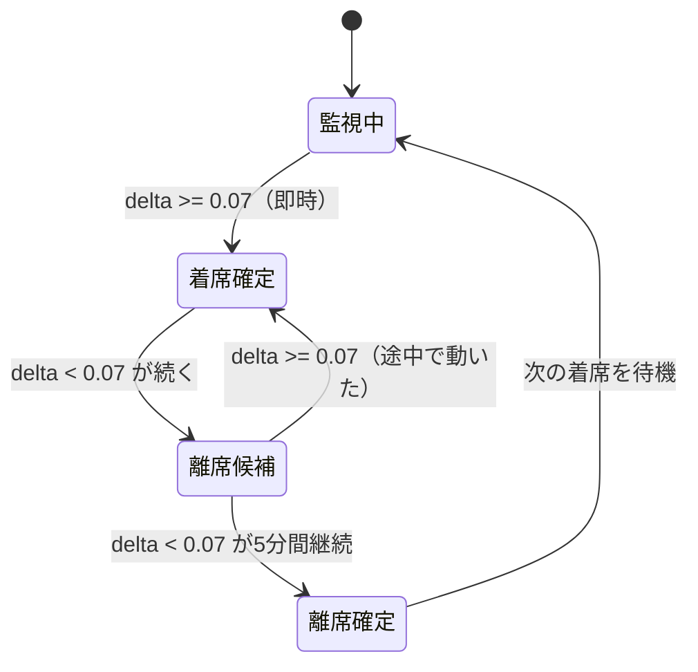

# 【古いスマホ活用術】重力センサーで「座った時間」を監視。毎日の作業時間をDiscordに全自動記録する0円DIY

## はじめに

引き出しの奥で眠っている「古いスマホ」、皆さんはどうしていますか？

在宅ワークが増えて、「自分が今日、実際に何時間机に向かって作業していたか」を正確に把握したいと思うようになりました。市販のIoT着席センサーやスマートチェアは数万円するし、スマートウォッチのスタンド機能は「特定の椅子に座って作業した時間」までは測ってくれません。

そこでひらめきました。**「スマホに標準搭載されている『重力センサー』を使えば、椅子に置くだけで座った瞬間を検知して、0円でIoTデバイスが作れるのでは？」**

結果として、使わなくなった古いAndroid（OPPO）を使って、**Discordに作業時間を全自動記録する着席トラッカー**を完成させました。まずは完成形をご覧ください。

<!-- ここにDiscordのスクショを挿入。例：「[着席] 09:15:03 作業を開始しました。」「[離席] 11:47:22 席を離れました。」 -->

<!-- ここに22:00に届くサマリーのスクショを挿入。例：「📊 着席サマリー 5月8日（木）\n09:15 〜 11:47 (2時間32分)\n13:02 〜 17:30 (4時間28分)\n合計着席: 7時間0分」 -->

今回は、このシステムがどう動いているか、そして開発中に立ちはだかった**「物理とOSの泥臭い壁」**について紹介します。

この記事は、こんな方に特におすすめです：

- 在宅ワークの生産性を可視化したいと思っている方
- 引き出しで眠っている古いスマホの活用方法を探している方
- 0円で面白いIoT工作をしてみたい方

今回作成したコードはGitHubで公開しています：

https://github.com/zabieru314/chair-logger

---

## どんなシステムか（全体像）

使い方はシンプルで、「椅子のクッションの上に古いスマホを置いておく」だけです。

**構成：**

| 要素 | 使ったもの |
|---|---|
| 端末 | 古いOPPO製Android（Android 15 / ColorOS） |
| 環境 | Termux ＋ Termux:API（Android上でLinux環境を動かす無料アプリ） |
| 言語 | Python 3 |
| DB | SQLite（スマホ内にローカル保存） |
| 通知 | Discord Webhook（リアルタイム ＋ 日次サマリー） |
| UI | Flask製Webダッシュボード（ポート8080） |

センサー監視・DB保存・Webサーバー・Discord通知まで、**すべてこの古いスマホ単体で完結**しています。クラウドも月額費用も一切なし。

Discordの通知は2チャンネル構成にしました：

- **デバッグチャンネル**：着席・離席のたびにリアルタイム通知
- **サマリーチャンネル**：毎日22:00に「何時から何時まで座ってたか」の日次まとめを自動送信

### システム全体の構成図

```
[古いAndroidスマホ]
  └── Termux（Python main.py）
       ├── SensorMonitor スレッド      ← 30秒ごとにセンサー取得・判定
       ├── TempMonitor スレッド        ← 60秒ごとにバッテリー温度監視
       ├── SummaryScheduler スレッド   ← 毎日22:00にサマリー送信
       └── Flask WebUI                ← PCブラウザからログ確認（ポート8080）
              ↓ Discord Webhook
         [着席/離席リアルタイム通知]
         [22:00 日次サマリー通知]
```

### なぜAndroidアプリ（Kotlin/Flutter）にしなかったのか

「Androidアプリとして作ればバックグラウンド処理も制御しやすかったのでは？」という疑問があるかもしれません。答えはシンプルで、**Android Studioを開いてアプリ開発環境を整えるより、古いスマホをLinuxサーバーとして扱うほうが圧倒的に早かった**からです。手慣れたPythonで数百行書けばすぐ動く。アプリとしてリリースするわけでもないので、この割り切りが正解でした。

---

## 開発の軌跡：立ちはだかった3つの壁

「センサー値を取って通知するだけでしょ？」と思うかもしれませんが、実際に作ってみると想定外のハードルが続出しました。

### 壁①：💥 Termux:APIの「binder崩壊」問題

最初は `termux-sensor` をサブプロセスで起動し続けて、500msごとにXYZ値をストリーミング取得する方法を試みました。

しかし長時間動かすとプロセスがフリーズ。「フリーズしたなら kill すれば再起動できるでしょ」と軽い気持ちで `pkill termux-sensor` を実行した瞬間、**Androidの奥底にあるプロセス間通信機構（binder）が完全に破壊**されました。

センサーが一切応答しなくなり、再起動しても直らない。調べまくった末に、GUIからTermux:APIアプリを「強制停止」しないと復旧できないとわかりました。`kill` コマンド1発でOSレベルの通信基盤が死ぬという極悪仕様です。

:::message alert
**警告：`pkill` や `SIGKILL` は絶対に実行しないでください**

`pkill termux-sensor` を実行すると、AndroidのIPC機構（binder）が破壊され、センサーが一切応答しなくなります。復旧にはTermux:APIアプリの強制停止（GUIから）が必要です。
:::

ソースコードを這いずり回ってようやく発見したのが `termux-sensor -c`（クリーンアップコマンド）の存在。これだけが唯一の正しい終了方法で、`SIGKILL` や `SIGTERM` はすべて禁忌でした。

この教訓から、センサーの取得方法を根本から変えることにしました。

### 壁②：🛋️ 最大の敵「クッションドリフト現象」

これが一番面白い発見でした。

最初のアプローチは「着席中と離席中それぞれの揺れ幅を計測してしきい値を自動設定する」キャリブレーション方式でした。手順はこうです：

1. 「今から10秒間座ってください」→ センサー値を20サンプル取得
2. 「今から10秒間立ってください」→ センサー値を20サンプル取得
3. 2つの平均値の中間をしきい値として自動設定

ところが実測してみると、結果を見て目を疑いました：

```log
着席中の平均差分: 0.0066  ← 小さい
離席後の平均差分: 0.0087  ← 大きい（逆になってる！）
```

なぜか**座っている時より、誰もいない椅子のほうがセンサーが大きく動いている**のです。「センサーが壊れた？」「コードのバグか？」と何度も見直しました。しかしどこにもバグはない。コードは正しい。センサーも壊れていない。なのに、なぜ無人の椅子の方が動いているんだ…？ としばらく頭を抱えていたとき、ふと、立ち上がった後のクッションがゆっくりと元の形に戻っていく様子が目に入りました。

もしかして、犯人はこれか…？

**「クッションドリフト」**です。人が立ち上がった直後、クッションは押しつぶされた形から元に戻ろうとして、ゆっくりと膨らみ続けます。その間、クッションの上に乗ったスマホも少しずつ動き続ける。誰もいない椅子で、クッションが深呼吸するように膨らんでいたのです。

<!-- ここに図を挿入：左「着席中（クッション凹み・スマホ安定）」右「離席直後（クッション膨らみ中・スマホが微妙に傾く）」 -->

:::message
**【画像 MUST ── バズの鍵。投稿前に必ず作成すること】**

折れ線グラフを入れる。X軸=時間、Y軸=XYZ差分delta。

- 着席中: 静かな低い値が続き、ときどきトゲ（0.04〜0.3）が立つ
- 離席直後: なだらかな山（クッションドリフト・約2分かけてゆっくり静止）
- 完全静止後: ペタッとゼロ付近に張り付く

**Excalidraw（https://excalidraw.com）で手書き風に作ると Zenn で非常に好まれる。X（旧Twitter）シェア時のCTRが大きく上がるので絶対に入れる。**
:::

<!-- 「着席中（クッション凹み・スマホ安定）」「離席直後（クッション膨らみ中・スマホが微妙に傾く）」の対比図も入れると尚良い -->

この動きが10秒間の計測にまるまる入り込んでいたため、「離席後」のほうが差分が大きく出てしまっていました。クッションが完全に静止するまでの時間は約2分以上。10秒の計測ウィンドウでは全く歯が立ちませんでした。

### 壁③：🔋 ColorOSのバッテリー最適化と発熱問題

OPPO（ColorOS）はバッテリー最適化が非常に積極的で、画面が消えるとTermux:APIが強制スリープされます。そのため現在は「充電しながら画面を常にオン（最低輝度）」で運用しています。

さらに古いスマホを連続稼働させると発熱が怖い。そこで**温度監視スレッド**を別途立ち上げ、バッテリー温度が40℃を超えたら自動でセンサー監視を5分間休止し、Discordに警告通知を送る安全装置を実装しました。

温度の取得は `termux-battery-status` コマンドのJSON出力から `temperature` フィールドをパースするだけです。これを60秒に1回叩いています。

```python:src/utils/hardware.py
import json, subprocess

out = subprocess.run(
    ["termux-battery-status"],
    capture_output=True, text=True, timeout=15,
)
data = json.loads(out.stdout)
temp = data.get("temperature", 0.0)  # 単位は摂氏
```

---

## 解決策：30秒ポーリング ＋ 非対称デバウンス

クッションドリフト問題の解決策として、アルゴリズムを全面刷新しました。

**核心のアイデア：センサーを「30秒に1回だけ」取得する**

連続ストリーミングをやめ、30秒ごとに `termux-sensor -s gravity -n 1` で1点だけ取得します（`-n 1` は「1回取得して終了」のオプション）。プロセスが自然終了するため、binder崩壊の心配もなくなります。

```python:src/core/sensor.py
# 30秒前の値と現在の値の差分を計算する
r = subprocess.run(
    ["termux-sensor", "-s", "gravity", "-n", "1"],
    capture_output=True, text=True, timeout=15,
)
# JSON出力からXYZ値をパース
x, y, z = parse_xyz(r.stdout)

# |ΔX| + |ΔY| + |ΔZ| の合計が「動きの大きさ」
delta = abs(x - prev_x) + abs(y - prev_y) + abs(z - prev_z)
```

実測するとこうなりました：

| 状況 | deltaの値 |
|---|---|
| 着席中（呼吸・体重移動） | 0.07 〜 0.30 |
| 離席後クッション完全静止 | 0.006 〜 0.009 |
| しきい値 | **0.07** |

**そして判定ロジックが「非対称デバウンス」です：**

```python:src/core/sensor.py
def evaluate_delta(delta: float) -> None:
    THRESHOLD = 0.07

    if delta >= THRESHOLD:
        # 動きを検知 → 着席を即座に確定
        if confirmed_state != "seated":
            confirm("seated")   # DBに記録 + Discord通知
        # 離席カウンターをリセット
        reset_left_timer()
        return

    # delta < THRESHOLD の場合：離席候補として待機
    if left_timer_elapsed() >= 300:  # 5分 = 300秒
        confirm("left")              # DBに記録 + Discord通知
```

ポイントは**着席は即確定・離席は5分待ち**という非対称な設計です。

- **着席が即確定な理由**：体の動き（座り直す、キーボードを打つ、腕を伸ばす）は瞬間的にdeltaを0.03以上に跳ね上げるため、1回検知すれば十分
- **離席が5分待ちな理由**：立ち上がった直後のクッションドリフトが落ち着くのを待つため。5分間ずっと静止していれば「本当に離席した」と判定できる

**なぜ「2回連続」にしなかったのか？ ── 実測で判明した「人間は意外と静止している」という事実**

実は最初の実装では「少し感度を上げて、delta >= 0.03 のような小さなスパイクが2回連続で来たら着席確定とする」という設計にしていました。（この 0.03 という値は閾値がまだ低かった頃の最初の設定で、後に 0.07 → 0.05 → 0.04 と段階的に調整していきます。直前の表の「0.07」とは別の話です。）しかし実際のログを見ると衝撃の事実が判明します。

```log
23:19:24  delta=0.008  → left（閾値以下）
23:19:56  delta=0.007  → left（閾値以下）
23:20:28  delta=0.073  → seated候補（閾値超え！）← スパイク
23:21:00  delta=0.015  → left（また閾値以下）
23:21:32  delta=0.007  → left（閾値以下）
```

座っている間も、**閾値を超えるスパイクは2〜3分に1回程度しか来ない**のです。人間は「常に動いている」のではなく「ときどき姿勢を変える」だけ。2回連続でスパイクが揃う確率は非常に低く、着席が永遠に確定しないバグになっていました。

「1回のスパイクで十分」という設計にしたことで、この問題が解消されました。

状態の流れをまとめるとこうなります：



この設計により、「クッションが膨らんでいる最中」に離席確定することがなくなりました。

---

## おまけ：4つのスレッドとSQLiteの格闘

このシステムは同時に4つのスレッドが走っています：

- **SensorMonitor**：30秒ごとにセンサー取得・判定
- **TempMonitor**：60秒ごとにバッテリー温度監視
- **SummaryScheduler**：毎日22:00にサマリー送信
- **メインスレッド**：FlaskのWebサーバー

問題は、センサースレッドとWebスレッドが同時にSQLiteへ読み書きに行く点です。Pythonのsqlite3はデフォルトで「接続を生成したスレッド以外から触ると壊れる」という制約があります。

対策として2段構えにしました：

```python:src/db/models.py
# ① プロセス内の書き込みを1本に絞るためのロック
_WRITE_LOCK = threading.Lock()

# ② アクセスのたびに短命なコネクションを生成（スレッドをまたがない）
with _WRITE_LOCK, sqlite3.connect(db_path) as conn:
    # WALモードで「書き込み中でも読み込みをブロックしない」設定
    conn.execute("PRAGMA journal_mode=WAL;")
    conn.execute("INSERT INTO chair_log ...")
```

`WAL（Write-Ahead Logging）モード`を有効にすることで、センサースレッドが書き込んでいる最中でもWebスレッドから読み込みができます。さらにプロセス内の書き込みはロックで1本に絞り、同時書き込みによるDB破損を防いでいます。古いスマホ1台でマルチスレッドサーバーを動かす都合上、こういう地味なところの設計が安定稼働の鍵です。

---

## 日次サマリーの自動送信

毎日22:00になると、その日の着席記録をSQLiteから集計して別チャンネルに送信します：

```python:src/utils/notifier.py
lines = [f"📊 着席サマリー {label}\n"]
for start, end, minutes in periods:
    h, m = divmod(minutes, 60)
    duration = f"{h}時間{m}分" if h else f"{m}分"
    lines.append(f"{start} 〜 {end}  （{duration}）")

th, tm = divmod(total_minutes, 60)
lines.append(f"\n合計着席: {th}時間{tm}分")
```

出力イメージ：

```log
📊 着席サマリー 5月8日（木）

09:15 〜 11:47  （2時間32分）
13:02 〜 17:30  （4時間28分）

合計着席: 7時間0分
```

SQLiteには着席・離席のタイムスタンプが全て記録されているので、過去のデータを遡ることもできます。

---

## 実はFlaskでWebUIも動いています

せっかくPythonが動いているので、Flaskも一緒に立ち上げています。スマホ内でWebサーバーが動いており、同じWiFiに繋がったPCのブラウザから `http://スマホのIP:8080` にアクセスすると、現在の着席ステータスや直近のログを確認できます。

<!-- ここにFlask WebUIのスクショを挿入 -->

古いスマホがセンサー・DB・Webサーバーをすべてホストしているという状況、なかなかシュールです。

**開発体験（DX）について補足**

「スマホ上でコードを書いてるの？画面が小さくてつらそう…」と思われるかもしれませんが、そんなことはありません。コードはすべてPCで書いてGitHubにpushするだけ。スマホ側は `git pull` して再起動するだけで変更が反映されます。スマホの画面は一切触りません。

```ini:.env.config
VARIANCE_THRESHOLD=0.07      # XYZ差分のしきい値
DEBOUNCE_LEFT_SEC=300        # 離席確定までの秒数（5分）
SENSOR_POLL_INTERVAL_SEC=30  # ポーリング間隔（秒）
MAX_TEMP_CELSIUS=40.0        # 温度上限
COOLDOWN_SLEEP_SEC=300       # 過熱時の休止時間
SUMMARY_TIME=22:00           # 日次サマリー送信時刻
```

閾値や送信時刻などのパラメータを変えたければ、PCでこのファイルを編集してpushするだけ。スマホ側の操作はゼロです。

---

## ⚠️ 注意・免責事項

本システムは古いスマートフォンを**常に充電状態・画面オン・クッション（布）の上**に置いて運用します。バッテリーの劣化具合によっては過熱・膨張・発火の危険性があります。

システム内に「バッテリー温度が40℃を超えたらセンサー監視を自動休止する」安全装置を実装していますが、**本記事の内容を試される場合は必ず自己責任のもと、周囲に燃えやすいものがない状況で運用してください。** 本記事の内容を使用した結果生じたいかなる損害についても、筆者は責任を負いかねます。

---

## おわりに

今回の開発で一番面白かったのは、「クッションドリフト」のような想定外の物理現象と向き合い、ソフトウェアの工夫で乗り越えていく過程そのものでした。うまくいかないことの連続でしたが、そのおかげで「30秒ポーリング＋非対称デバウンス」という自分なりのアルゴリズムにたどり着けたと思っています。

引き出しに眠っていた古いスマホが、0円で**「最高の生産性管理トラッカー」**に生まれ変わりました。Discordに毎日自動で作業時間が記録されるようになってからは、「今日は7時間座れた」「今週は思ったより短かった」という気づきが増え、在宅ワークの質が変わってきた気がします。

**今後やってみたいこと：**

- 週次・月次の生産性レポートを自動生成する機能
- 長時間座りっぱなしの時に休憩を促すアラート
- Raspberry Pi Pico + 圧力センサーへの置き換え（画面オン制約を完全解消）

コードはGitHubで公開しています。Termuxへのデプロイ手順や必要なパッケージもREADMEに記載しているので、「動かしてみたい」「コードを読みたい」という方はリポジトリをぜひ覗いてみてください。スターをつけていただけると励みになります。

https://github.com/zabieru314/chair-logger

もし**「詳しい構築手順を知りたい」「Termux環境のセットアップから教えてほしい」** という声が多ければ、ステップバイステップの環境構築記事も書こうと思います。

興味を持っていただけた方は、ぜひ **いいね（ハート）** やコメントをお願いします！
